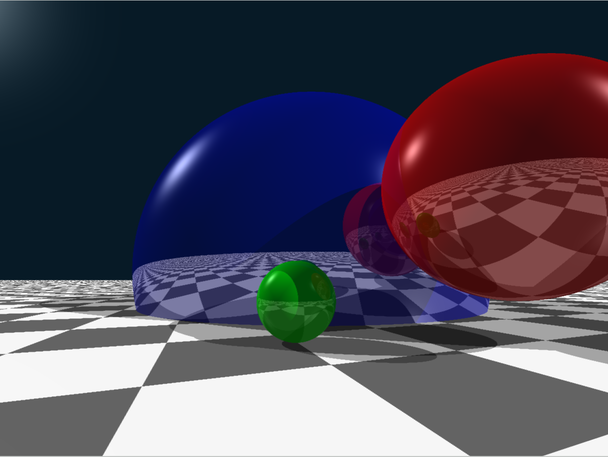

# My-OpenGL-Engine
A simple Ray Tracer written in C++ with OpenGL\
Compared to the older [Py-RayTracer](https://github.com/Xallt/Py-RayTracer) this is a major improvement in both speed and quality

Ray Tracer result:

